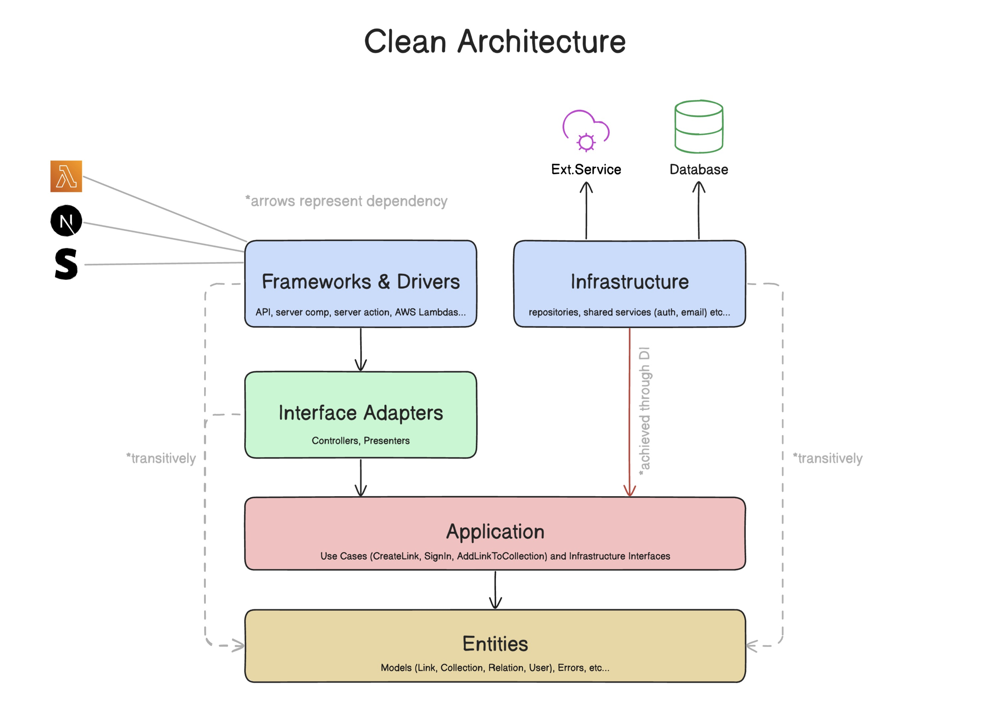

# maxmurr AI chat

Next.js 16 chat UI backed by Mastra and Vercel AI Gateway through AI SDK v7.

## Requirements

- Bun 1.4+
- Node.js 22.13+ compatibility for Mastra
- Docker
- Vercel AI Gateway API key

## Setup

```bash
bun install
docker compose up -d
cp .env.example .env.local
openssl rand -base64 32
```

Set `AI_GATEWAY_API_KEY` and put generated value in `BETTER_AUTH_SECRET`.

Email verification and workspace invitation delivery need a Resend API key and verified sending domain.
Set `RESEND_API_KEY` and `RESEND_EMAIL_FROM`, such as `AI Chat <notifications@yourdomain.com>`.
Without both values, local authentication keeps email verification optional and does not deliver invitation email.

Then run:

```bash
bun run db:migrate
bun dev
```

Open [http://localhost:3000/sign-up](http://localhost:3000/sign-up). Google sign-in is optional; add Google credentials and authorize `http://localhost:3000/api/auth/callback/google` to enable it.

## Slack

### Local webhook with ngrok

Run the app, then expose port 3000:

```bash
ngrok config add-authtoken <NGROK_AUTHTOKEN> # first setup only
ngrok http 3000
```

Use the HTTPS forwarding URL from ngrok as `<YOUR-PUBLIC-URL>`. Free ngrok URLs can change after a restart; update both Slack request URLs when they do.

### Slack app manifest

Open [api.slack.com/apps](https://api.slack.com/apps), choose **Create New App → From a manifest**, select the workspace, and paste:

```yaml
display_information:
  name: maxmurr-ai-chat

features:
  app_home:
    home_tab_enabled: false
    messages_tab_enabled: true
    messages_tab_read_only_enabled: false
  bot_user:
    display_name: maxmurr-ai-chat
    always_online: true

oauth_config:
  scopes:
    bot:
      - im:write
      - app_mentions:read
      - channels:history
      - channels:read
      - chat:write
      - chat:write.customize
      - users:read
      - users:read.email
      - im:read
      - im:history
  pkce_enabled: false

settings:
  event_subscriptions:
    request_url: https://<YOUR-PUBLIC-URL>/api/agent-controllers/chat-assistant-controller/channels/slack/webhook
    bot_events:
      - app_mention
      - message.channels
      - message.im
  interactivity:
    is_enabled: true
    request_url: https://<YOUR-PUBLIC-URL>/api/agent-controllers/chat-assistant-controller/channels/slack/webhook
  org_deploy_enabled: false
  socket_mode_enabled: false
  token_rotation_enabled: false
  is_mcp_enabled: false
```

Install the app to the workspace. Add these values to `.env.local`, then restart Next.js:

```dotenv
SLACK_BOT_TOKEN=xoxb-...
SLACK_SIGNING_SECRET=...
```

Find `SLACK_BOT_TOKEN` under **OAuth & Permissions → Bot User OAuth Token**. Find `SLACK_SIGNING_SECRET` under **Basic Information → App Credentials → Signing Secret**. Single-workspace setup needs no Slack client ID or client secret.

Use this endpoint for both **Event Subscriptions** and **Interactivity**:

```text
https://<YOUR-PUBLIC-URL>/api/agent-controllers/chat-assistant-controller/channels/slack/webhook
```

If Slack could not verify the URL during manifest import, add the credentials, restart the app, then save the URL again. Reinstall the Slack app if requested. Invite it into each public channel where it should answer:

```text
/invite @maxmurr-ai-chat
```

Slack verifies webhook signatures. The bot answers only Slack users whose email matches a signed-in Workspace member; others get a sign-in hint. `users:read.email` is required for that match. `chat:write.customize` lets a user-initiated web turn appear as `<name> (Console)` with the web profile image; Slack still marks it as an app message. Reinstall the Slack app after adding either scope. Avoid Slack Connect channels unless external members may use the assistant.

Slack runs through Mastra Agent Controller sessions. PostgreSQL stores channel threads in the `mastra` schema, and Redis Streams coordinates signals between app processes. Run Next.js on a long-lived Node server because live controller sessions and pending approvals remain process-local.

Each Slack thread is one Chat, owned by the member who started it and visible in the web sidebar. Slack turns are mirrored into the Chat, and web turns on that Chat are posted back into the Slack thread with the assistant's reply. See `docs/adr/0006-slack-threads-link-to-app-chats.md`.

## Architecture



Dependencies point inward. `bun run lint` rejects imports that cross these layers in the wrong direction.

| Layer                  | Paths                               | Responsibility                                              |
| ---------------------- | ----------------------------------- | ----------------------------------------------------------- |
| Frameworks and drivers | `app`, `components`, `hooks`, `lib` | Next.js routes and UI                                       |
| Interface adapters     | `src/interface-adapters`            | Input validation, controllers, presenters                   |
| Application            | `src/application`                   | Use cases and infrastructure interfaces                     |
| Entities               | `src/entities`                      | Provider-neutral models and errors                          |
| Infrastructure         | `src/infrastructure`                | Mastra and future repository implementations                |
| Composition root       | `di`                                | Type-safe Ioctopus registry, modules, and production wiring |
| Database driver        | `drizzle`                           | Drizzle client, schema, migrations                          |

Chat flow: `app/api/chat/route.ts` -> `di/application-container.ts` -> chat controller -> application service interface -> Mastra adapter.

## Checks

```bash
bun test
bun run lint
bunx tsc --noEmit
bun run build
```

Add tables in `drizzle/app-schema.ts`, then run `bun run db:generate && bun run db:migrate`.
